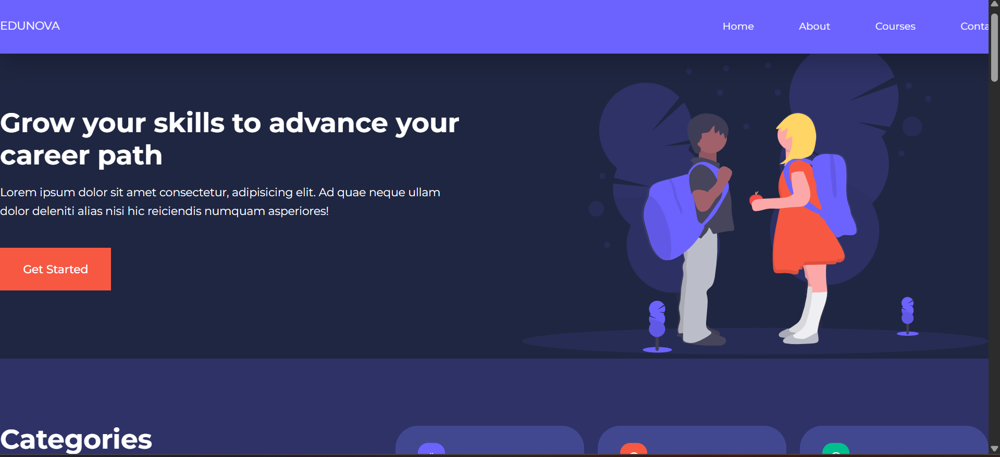
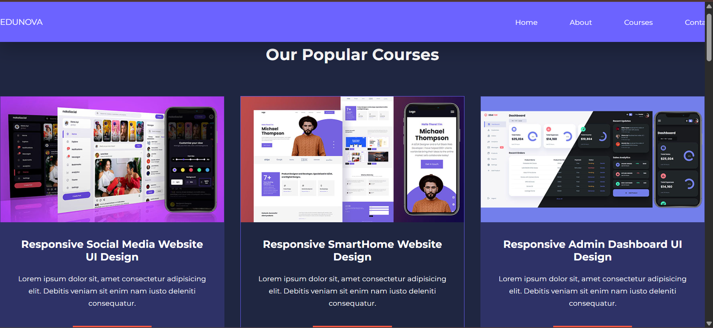
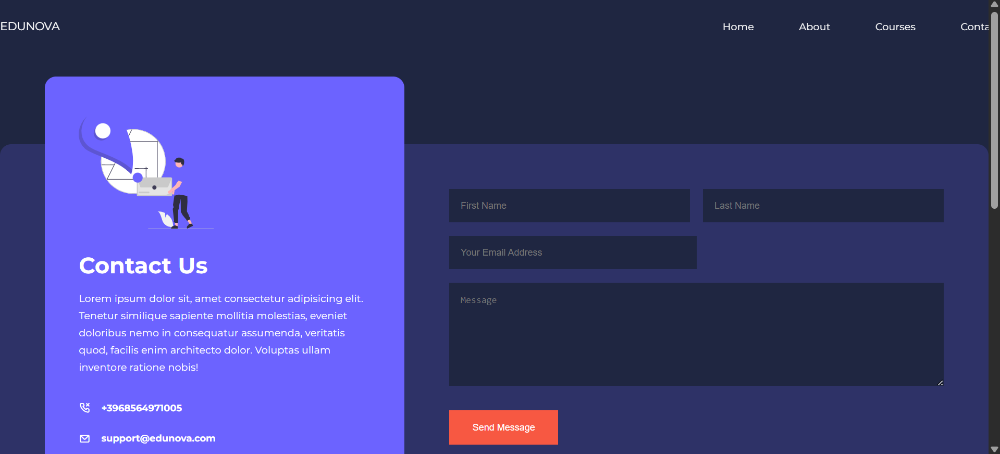

# Edunova 
> Edunova is an educational technology (EdTech) website built with **HTML, CSS, and JavaScript** to showcase courses, contact info, and more in a clean, responsive design.
> **Live Demo:** https://shruti423.github.io/Edunova/

##  Screenshots

<p align="center">
  
  
</p>

<p align="center">
  
</p>


---

##  About The Project

Edunova is a front-end web project that provides a user-friendly interface to explore educational content. It’s perfect for showcasing your skills or using as a foundation for a real EdTech platform.  
Built using **modern web design principles**, this project demonstrates navigation, layout, responsive design, and interactive JS elements.

---

## Features

✨ **Responsive design** – Works on mobile and desktop.  
📄 Multiple pages – Home, About, Courses, Contact.  
🎨 Styled with CSS for a modern look.  
🔧 Basic JavaScript for interaction.  

---

## File Structure
```
Edunova/
├── css/
│ └── style.css
| └── about.css
| └── contact.css
├── images/
├── screenshots/
├── index.html
├── about.html
├── courses.html
├── contact.html
└── main.js
```
##  Getting Started

To run this project locally:

1. Clone the repository
   ```bash
   git clone https://github.com/shruti423/Edunova.git
2. Open index.html in your browser
No additional dependencies are required.

##  Future Enhancements

- Add backend support for user authentication
- Integrate real courses and video content
- Add contact form validation
- Improve accessibility and SEO

##  Author

**Shruti**  
GitHub: https://github.com/shruti423

##  License
This project is open source and available for learning and personal use.
